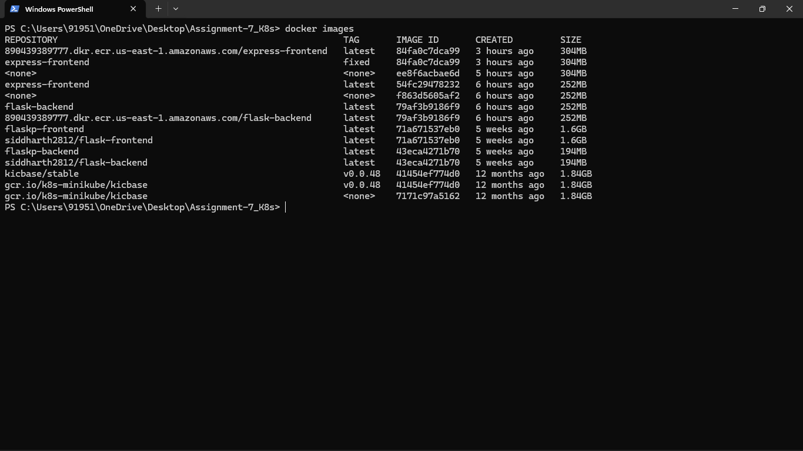
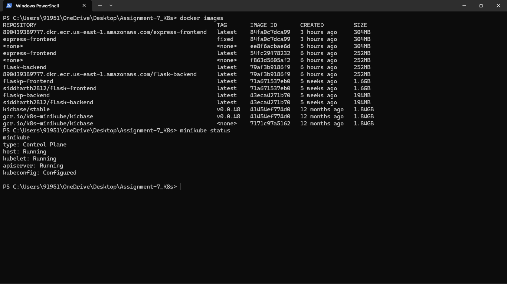
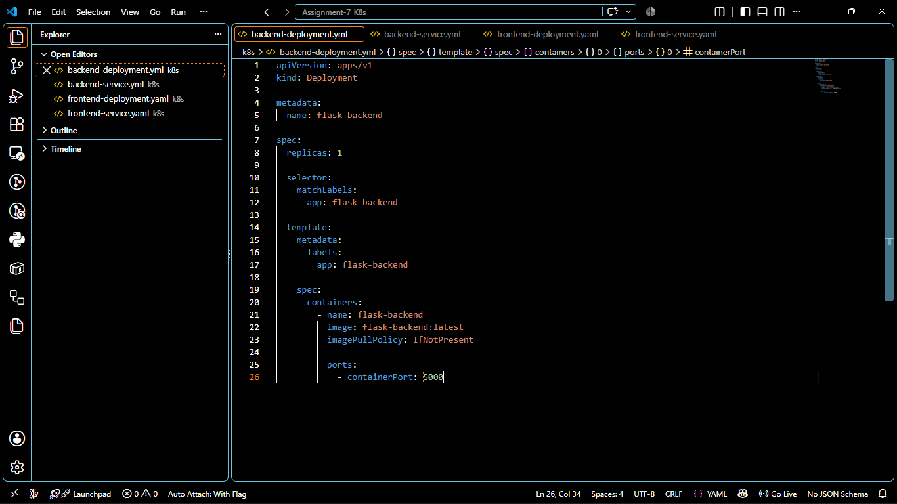
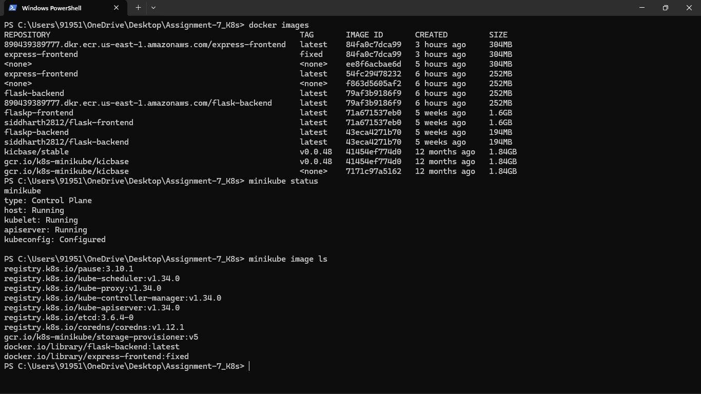
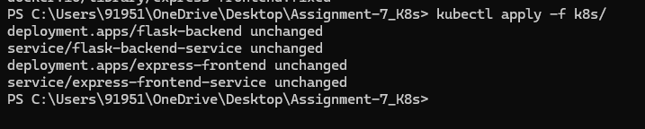
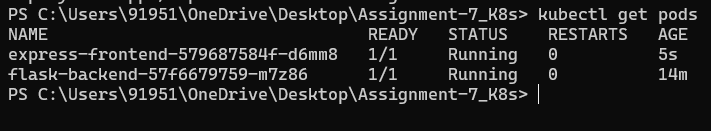
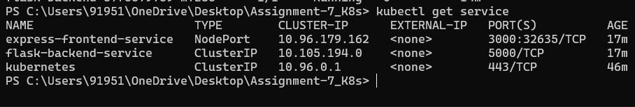
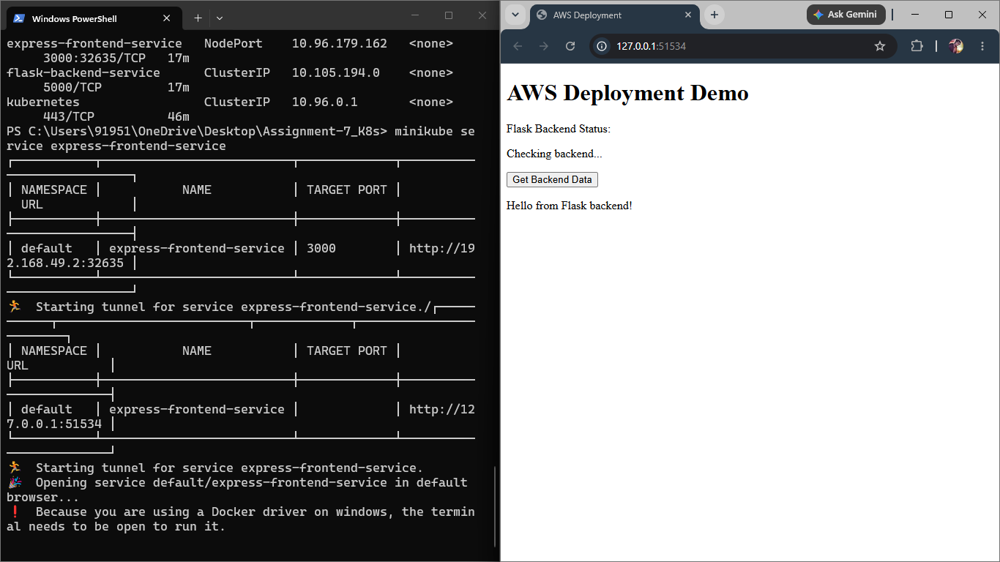
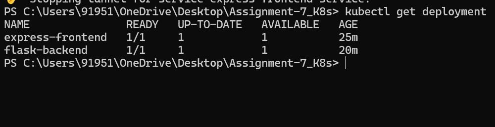

# 🚀 Full-Stack Application Deployment using Kubernetes and Minikube

## 📌 Project Overview

This project demonstrates the deployment of a full-stack application on a local Kubernetes cluster using **Minikube**.

The application consists of:

- 🟢 **Express Frontend** running on port **3000**
- 🐍 **Flask Backend** running on port **5000**

Both applications are containerized using Docker and deployed to Kubernetes using **Deployments** and **Services**.

---

## 🎯 Objective

The objective of this project is to deploy a full-stack application locally using Kubernetes and Minikube.

The project includes:

- Dockerized frontend and backend applications
- Kubernetes Deployments
- Kubernetes Services
- Local Kubernetes cluster using Minikube
- Loading local Docker images into Minikube
- Verifying Pods, Services, and Deployments
- Frontend-to-backend communication

---

## 🛠️ Technologies Used

- Docker
- Docker Desktop
- Kubernetes
- Minikube
- kubectl
- Flask
- Python
- Express.js
- Node.js

---

## 🏗️ Architecture

```text
                    ┌───────────────┐
                    │    Browser    │
                    └───────┬───────┘
                            │
                            ▼
              ┌──────────────────────────┐
              │ Express Frontend Service │
              │       (NodePort)         │
              └────────────┬─────────────┘
                           │
                           ▼
              ┌──────────────────────────┐
              │   Express Frontend Pod   │
              │       Port: 3000         │
              └────────────┬─────────────┘
                           │
                           ▼
              ┌──────────────────────────┐
              │ Flask Backend Service    │
              │       (ClusterIP)        │
              └────────────┬─────────────┘
                           │
                           ▼
              ┌──────────────────────────┐
              │    Flask Backend Pod     │
              │       Port: 5000         │
              └──────────────────────────┘
```

---

## 📁 Project Structure

```text
Assignment-7_K8s/
│
├── backend/
│   ├── app.py
│   ├── requirements.txt
│   └── Dockerfile
│
├── frontend/
│   ├── package.json
│   └── Dockerfile
│
├── k8s/
│   ├── backend-deployment.yaml
│   ├── backend-service.yaml
│   ├── frontend-deployment.yaml
│   └── frontend-service.yaml
│
├── screenshots/
│   ├── 01_Docker_Images.png
│   ├── 02_Minikube_Running.png
│   ├── 03_Kubernetes_YAML_Files.png
│   ├── 04_Images_Loaded_To_Minikube.png
│   ├── 05_Kubectl_Apply_Deployments.png
│   ├── 06_Kubernetes_Pods_Running.png
│   ├── 07_Kubernetes_Services.png
│   ├── 08_Application_Running.png
│   └── 09_Kubernetes_Deployments.png
│
├── Kubernetes_Assignment_Documentation.docx
└── README.md
```

---

# 🐳 Step 1: Docker Images

The following Docker images were used for deployment:

| Application | Docker Image | Port |
|---|---|---|
| Flask Backend | `flask-backend:latest` | `5000` |
| Express Frontend | `express-frontend:fixed` | `3000` |

### Command

```powershell
docker images
```

### 📸 Screenshot



---

# ☸️ Step 2: Start Minikube

Minikube was started using the Docker driver.

```powershell
minikube start --driver=docker --cpus=2 --memory=3000mb
```

Verify the Minikube cluster:

```powershell
minikube status
```

### 📸 Screenshot



---

# 📄 Step 3: Kubernetes Configuration Files

Four Kubernetes YAML files were created:

### Backend

- `backend-deployment.yaml`
- `backend-service.yaml`

### Frontend

- `frontend-deployment.yaml`
- `frontend-service.yaml`

### 📸 Screenshot



---

# 📦 Step 4: Load Docker Images into Minikube

The locally created Docker images were loaded into Minikube.

### Load Flask Backend

```powershell
minikube image load flask-backend:latest
```

### Load Express Frontend

```powershell
minikube image load express-frontend:fixed
```

Verify the images:

```powershell
minikube image ls
```

### 📸 Screenshot



---

# 🚀 Step 5: Deploy Applications to Kubernetes

Deploy all Kubernetes resources using:

```powershell
kubectl apply -f k8s/
```

This creates:

- Flask Backend Deployment
- Flask Backend Service
- Express Frontend Deployment
- Express Frontend Service

### 📸 Screenshot



---

# ✅ Step 6: Verify Running Pods

Check the Kubernetes Pods:

```powershell
kubectl get pods
```

Both Pods should be in the `Running` state.

### 📸 Screenshot



---

# 🔌 Step 7: Verify Services

Check the Kubernetes Services:

```powershell
kubectl get services
```

The services used are:

| Service | Type | Port |
|---|---|---|
| `express-frontend-service` | NodePort | 3000 |
| `flask-backend-service` | ClusterIP | 5000 |

### 📸 Screenshot



---

# 🌐 Step 8: Access the Application

The Express frontend was accessed through Minikube using:

```powershell
minikube service express-frontend-service
```

The application successfully opened in the browser and communicated successfully with the Flask backend.

### 📸 Screenshot



---

# 📊 Step 9: Verify Deployments

Verify the Kubernetes Deployments:

```powershell
kubectl get deployment
```

Both deployments should show one available replica.

### 📸 Screenshot



---

# 🎉 Results

The full-stack application was successfully deployed on a local Kubernetes cluster using **Minikube**.

✅ Flask Backend deployed successfully  
✅ Express Frontend deployed successfully  
✅ Kubernetes Pods running successfully  
✅ Kubernetes Services configured successfully  
✅ Frontend exposed using NodePort  
✅ Backend exposed internally using ClusterIP  
✅ Frontend successfully connected to the backend  

---

# 👨‍💻 Author

**Siddharth**

---

⭐ If you found this project useful, feel free to explore the repository.
